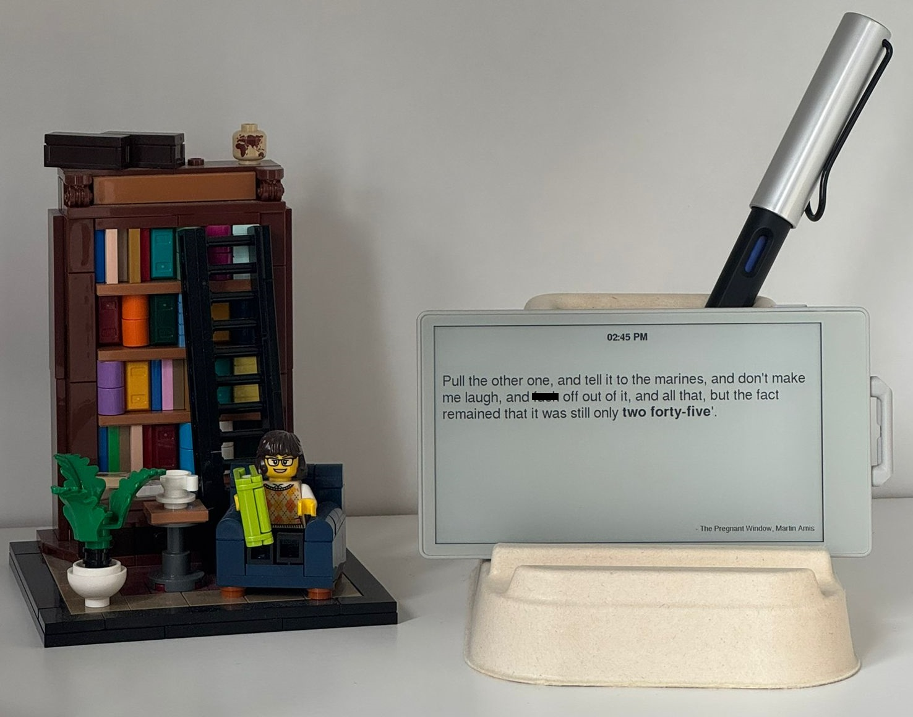

# Literature Clock (M5Stack PaperS3)

A physical **Literature Clock** built using the M5Stack PaperS3 (ESP32).  
It displays literary quotes that correspond to the current time.

Inspired by and based on the original dataset:  
https://github.com/JohannesNE/literature-clock

---

## ✨ Features

- Time-based literary quotes (updates every minute)
- WiFi configuration portal
- NTP time synchronisation
- Touchscreen interaction (long press to open setup)
- Night mode (00:00–06:00, no new quotes shown)
- Local storage using LittleFS

---

## 🛠 Hardware

- M5Stack PaperS3 (ESP32)  
  https://docs.m5stack.com/en/core/papers3

- IKEA phone stand (used as a base)  
  https://www.ikea.com/gb/en/p/hoensnaet-holder-for-mobile-phone-natural-10564895/

- Small neodymium magnets  
  (mounted inside the stand to hold the device in place)

- USB power supply (**5V only**)

---

## ⚙️ Setup / First Use

1. Power on the device  
2. Connect to WiFi network:
   - SSID: `LiteratureClockSetup`
   - Password: `12345678`
3. Open a browser and go to the address shown on screen  
4. Enter:
   - Your home WiFi SSID
   - Your WiFi password
   - Timezone offset (default: 0 = UK)
5. Save → device will reboot and connect automatically

---

## 🧭 Controls

- **Power ON:** single click  
- **Power OFF:** double click  
- **Open setup portal:** long press on screen (while a quote is displayed)

---

## 📂 Data Format

Quote files are stored as:

    /data/HH_MM.json

Example:

```json
[
  {
    "time": "06:07",
    "quote_first": "Example text before ",
    "quote_time_case": "six oh seven",
    "quote_last": " and after.",
    "title": "Example Book",
    "author": "Author Name"
  }
]
```
---

## 📁 Project Structure & Upload

The project should be organised like this:

```
LiteratureClock/
├── LiteratureClock.ino
├── partitions.csv
└── data/
    ├── 00_00.json
    ├── 00_01.json
    ├── ...
    └── 23_59.json
```
    
---

## 🚀 Upload Instructions
1. Open LiteratureClock.ino in Arduino IDE
2. Select board: M5PaperS3 (ESP32)
3. Upload the sketch
4. Upload the filesystem:
   - Use ESP32 LittleFS Upload Tool
   - Upload the entire _data/_ folder
5. Reboot the device
  
---

## ⚙️ partitions.csv

Make sure the project uses the included `partitions.csv`.

In the Arduino IDE, set:

`Tools → Partition Scheme → Custom`

Without this, there may not be enough space for the quote files and the device will show:

> “No quote for time”

---

## 📚 Data Source & Attribution

This project uses and adapts the dataset from:  
https://github.com/JohannesNE/literature-clock

**Original license:**  
Creative Commons Attribution-NonCommercial-ShareAlike 2.5

---

## ✏️ Modifications to Dataset

Added missing time entries:
- 06_07.json
- 06_18.json
- 08_21.json
- 10_28.json
- 11_46.json
- 12_31.json
- 13_36.json
- 18_44.json


---

## ⚠️ License Notes

- Quote dataset remains under **CC BY-NC-SA 2.5**  
- This project is therefore **non-commercial**  
- Attribution to the original project is required  

---

## 🔌 Important

**Use only 5V power supplies.**  
Higher voltage may permanently damage the device.

---

## 📸 Photo

(Add your device photo here)

Example after uploading:



---

## 📦 Bill of Materials

| Item | Description |
|------|------------|
| M5Stack PaperS3 | Main device |
| IKEA HÖNSNÄT stand | Stand (moulded paper pulp) |
| Neodymium magnets | Internal mounting |
| USB cable + 5V adapter | Power |

---

## 🙏 Credits

Original Literature Clock concept and dataset:  
https://github.com/JohannesNE/literature-clock
